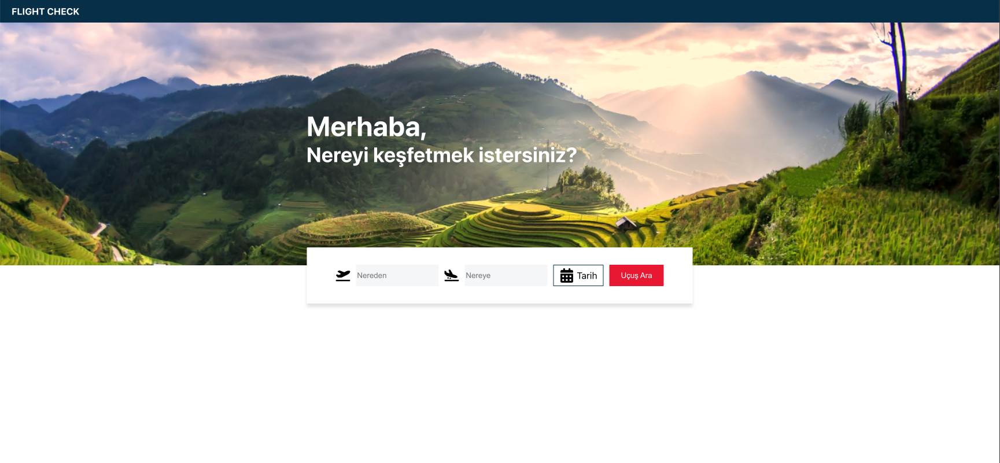
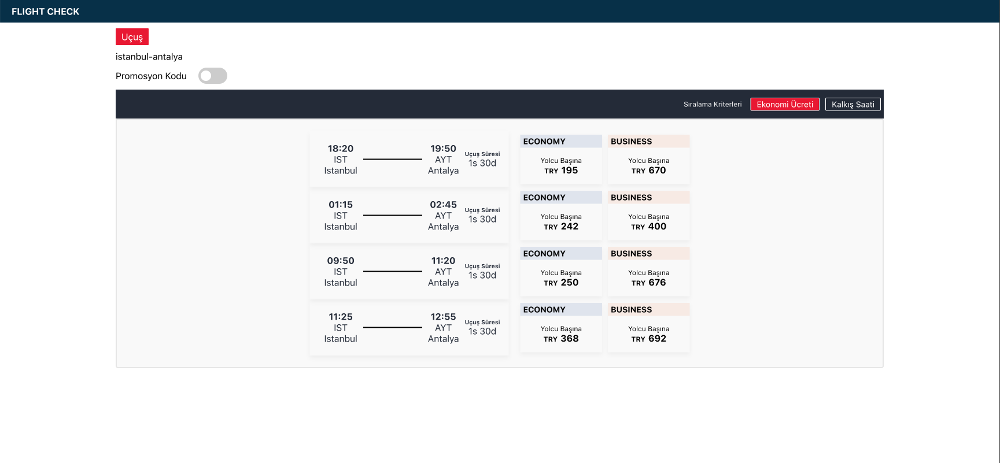
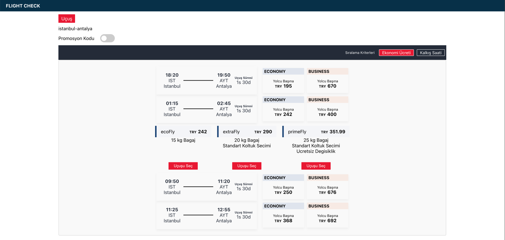
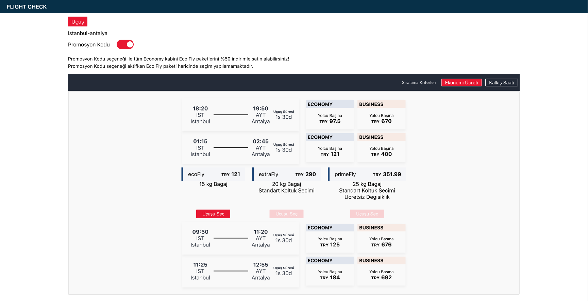
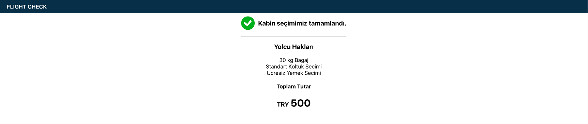

FLIGHT-CHECK is buying flight ticket application.

## Installation

First, clone this [repository](https://github.com/mesutkoc/flight-check.git).

`git clone https://github.com/mesutkoc/flight-check.git`

Install npm

`npm install`

To run project.

`npm start`

To run test.

`npm test`

### User Story

- User can search tickets by input and listing tickets that contains user input.
- User can sort tickets by filter bar.
- User can see flights details with collapsible view.
- User can select ticket, if flight status is available.
- Success screen will shown, if flight status is available, otherwise error screen will shown.
- User can see total price and passenger rights in success screen.

### Technologies

- Reactjs
- React Context
- React Router Dom
- Sass/Scss css pre-processor

### Screenshots

- Search Location
  

- View Flights
  

- Click Flight and See Detail
  

- Apply Promotion
  

- Select Flight and Success
  
